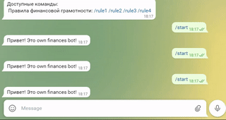

# Приведение типов. Информативные команды. 
## Приведение типов.
**Телеграм-боты** - это особые программы, которые получают текст и текст возвращают. В `Python` хранение текстовых данных осуществляется с помощью строкового типа (`str`). Для данного типа данных определен только один оператор `+`, который объединяет строки.
```py
str1 = "Hello, "
str2 = "world!"
str3 = str1 + str2 # значение str3 будет равным "Hello, world!"
print(str3)
```
Данная программа выведет в консоль строку `"Hello, world!"`  
Но `Python` работает и с другими типами данных. Самые распространенные из них - это тип целых чисел (`int`) и логический тип (`bool`).  
Сложнее всего переводить строковые данные в числовые. Т.к. не все строковые данные можно перевести в числовые. Например строка `'12'` приводится к числу `12`, а строка `'Hello!'` не приводится не к какому числу. Более того - при попытке перевести такую строку в числовой тип данных возникает ошибка.  
Чтобы такой ошибки не возникало используется специальный метод `isdigit()`, который можно применять к любой переменной строкового типа.
При переводе данных одного типа в данные другого типа необходимо проверить возможно ли это.  
Пример работы метода `isdigit()` если переменная не может быть приведена к числу (метод вернет логическое значение `False` - ложь):  
```py
string_in = "Hello"
print(string_in.isdigit()) # вернет False
```
Пример работы метода `isdigit()` если строковая переменная состоит из символов-цифр, т.е. приводится к числу (метод вернет логическое значение `True` - истина)
```py
string_in = "12"
print(string_in.isdigit()) # вернет True
```
## Информативные команды.
В предыдущие дни мы уже научили бота реагировать на команды `'/start'` и `'/help'`. Эти две команды имеют специфическое назначение для ботов: `'/start'` всегда выполняется при начале работе с ботом, а `'/help'` выводит информацию о всех существующих командах, доступных при работе с ботом.  
Но таким же образом можно использовать любые другие команды. В результате - вы сможете создать из бота справочную систему или материал для подготовки к экзаменам, зачетам и контрольным: команды будут содержать номер вопроса, например `/task1`, `/task2`, `/task3`, ...  а сообщениями, отправляемыми в ответ на такие запросы будет материл по теме.
### Финансовые правила в боте
Тематикой создаваемой нами бота являются личные финансы. И мы предлагаем расширить функционал создаваемого бота подсказками по основным правилами финансовой грамотности (взяты с сайта [businessviews.com.ua](https://businessviews.com.ua/ru/business/id/pravila-finansovoj-gramotnosti-2372/)):  
**1. Считай мелкие расходы**  
Небольшие расходы, которые ты обычно не учитываешь, в итоге перерастают в приличную сумму. Сегодня 40 гривен на кофе, завтра неожиданный хот-дог… Необязательно учитывать все расходы до копейки, но есть смысл записывать хотя бы те, которые больше 0,5 процента от дохода.   
  
**2. Ставь долгосрочные финансовые цели**  Например, ты хочешь отложить деньги на ноут или на отпуск — это и есть цель. Цели нужно знать, чтобы держать их в уме и понимать, ради чего ты сегодня не потратишь 40 гривен на кофе. Это психология — отказываться от каких-то расходов проще, если ты знаешь, ради чего это делаешь. 

**3. Прокачивай свои профессиональные навыки**  Чтобы зарабатывать больше.  

  
**4. Живи как инвестор**  Принимая решения, оценивай их так, как инвестор оценивает бизнес, в который намерен инвестировать. Задавай себе вопросы: а что я с этого буду иметь? Какой результат я получу и когда? Как я смогу получить еще лучший результат? Это упражнение, которые помогает прокачать личную продуктивность, освободить время от ненужных занятий и наполнить его полезными — и с точки зрения финансов, и с точки зрения моральной удовлетворенности от результата. 

```py
from telegram.ext import Updater, MessageHandler, Filters

def echo(update, context):
    string_in = update.message.text

    if string_in == '/start':
        string_out = 'Привет! Это own finances bot!'
    elif string_in == '/rule1':
        string_out = '1. Считай мелкие расходы \n Небольшие расходы, которые ты обычно не учитываешь, в итоге перерастают в приличную сумму. Сегодня 40 гривен на кофе, завтра неожиданный хот-дог… Необязательно учитывать все расходы до копейки, но есть смысл записывать хотя бы те, которые больше 0,5 процента от дохода.   '
    elif string_in == '/rule2':
        string_out = '2. Ставь долгосрочные финансовые цели  \n Например, ты хочешь отложить деньги на ноут или на отпуск — это и есть цель. Цели нужно знать, чтобы держать их в уме и понимать, ради чего ты сегодня не потратишь 40 гривен на кофе. Это психология — отказываться от каких-то расходов проще, если ты знаешь, ради чего это делаешь.    '
    elif string_in == '/rule3':
        string_out = '3. Прокачивай свои профессиональные навыки \n Чтобы зарабатывать больше.     '
    elif string_in == '/rule4':
        string_out = '4. Живи как инвестор \n Принимая решения, оценивай их так, как инвестор оценивает бизнес, в который намерен инвестировать. Задавай себе вопросы: а что я с этого буду иметь? Какой результат я получу и когда? Как я смогу получить еще лучший результат? Это упражнение, которые помогает прокачать личную продуктивность, освободить время от ненужных занятий и наполнить его полезными — и с точки зрения финансов, и с точки зрения моральной удовлетворенности от результата.    '
    else:
        string_out = string_in


    update.message.reply_text(string_out)

updater = Updater("")

dispatcher = updater.dispatcher

dispatcher.add_handler(MessageHandler(Filters.all, echo))

updater.start_polling()
updater.idle()


```

